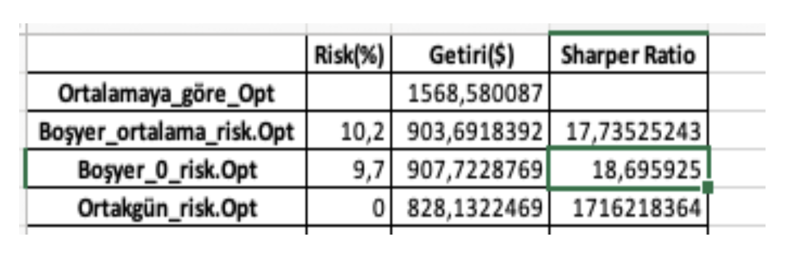
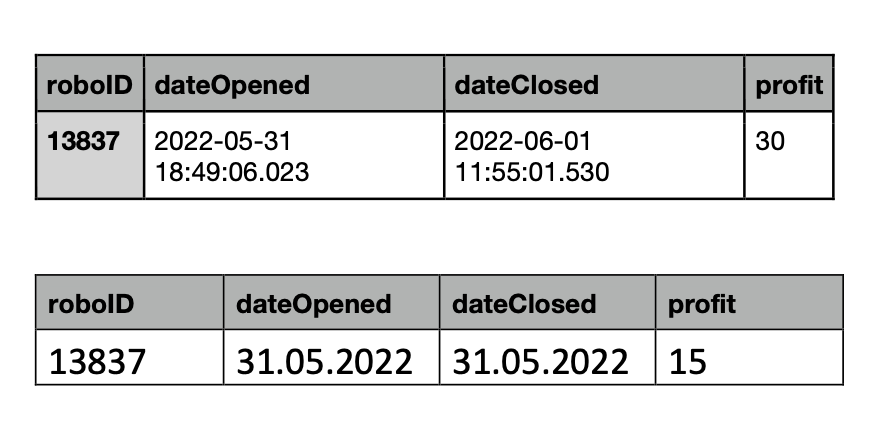
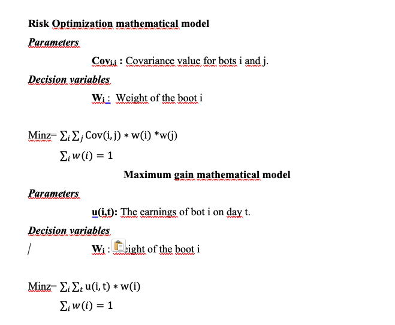
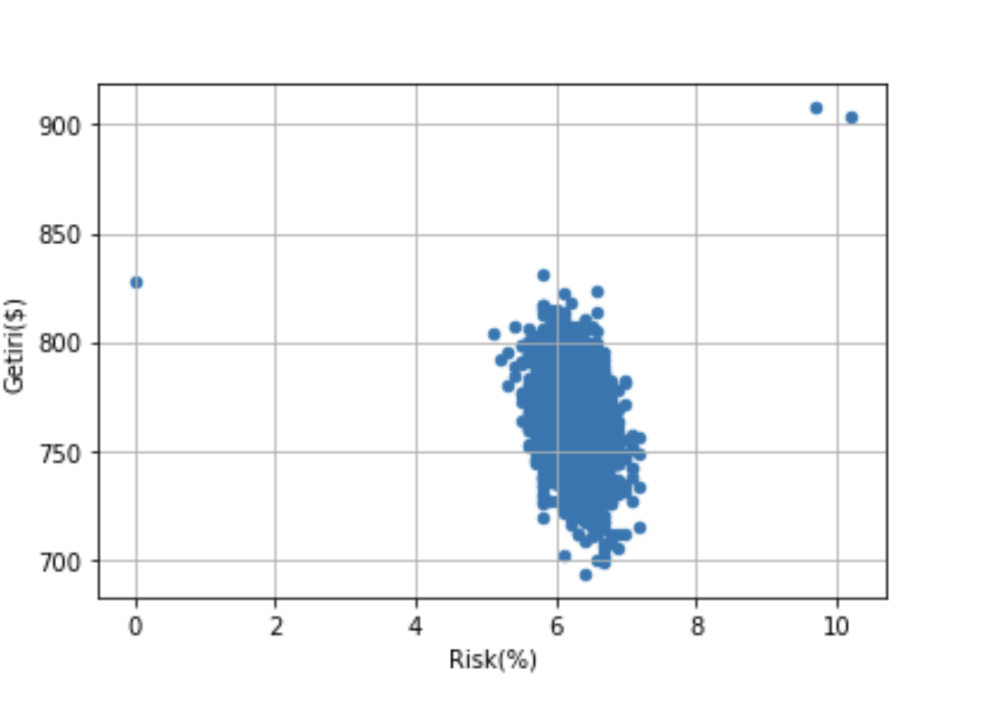

# Project work summary
Two methods were used to analyze the data:

**Modern portfolio theory (MPT)**: or this method to be used, the data must be complete  there should be data for date 't' for all bots. For this reason, 3 methods were used to complete the missing data for the bots.

- Completing the earnings of the missing days as the average earnings of the bot

- Taking the earnings of the missing days as 0.

- Taking into account the days common to all boats

**Monte Carlo method (MC)**: randomly generate 3000 weights and averagecalculation of risk, return and sharpe ratio. The calculation of the relevant performance criteria is based on the common days in the bots.

For the 3 items used in the Mpt method, only optimization was done according to risk. Return optimization was used for the original data and missing days were not filled in in any way.

 

 # System description
 First of all, when the earnings data of the bots are examined, it is seen that the earnings of the bots cover a certain period, and these earnings are logged.

Example:

 
 In addition, since the end of the period and the beginning of the new period of some bots are on the same day, the earnings for the relevant day are averaged.

In addition, the start day and end day for the relevant data set are based on the earliest start and latest end date from all bots.

 

 The related models were written in python using the gurobi library.

 # Evaluation of results.
 The results generated by the algorithm are saved as 'Result.xlsx'. The investment amount is 500 units.
The first column in the results has no risk and sharpe ratio since it only aims to maximize the profit. In the next 3 columns there are risk optimization results and then MC results.

 

When the results are analyzed, the average risk is between 5% - 7% and the earnings are between 700 - 850. If the Sharpe ratio is taken into account, we can only use return optimization, in which case our earnings will be doubled.

# Code descriptions
  ## Function descriptions
**opti_riskazaltma:**  function of the risk gurobi model.

**opti_ortalama:** function of the return gurobi model

**convert_date_to_excel_ordinal:** function to convert dateOpened dates to excel integer.

**fiyatlari_duzenleme:** function to convert data to price data only (row dates, column bot earnings).

**expectedV:** function that multiplies the weights to the unedited data and calculates the total expected profit.

**convert_date_to_excel_ordinal2:** function that converts DateClosed dates to excel integer. 

**veri_tamamlama:** function that organizes the dates in the dataset according to the log and creates missing days according to the status variable.

If status==0:

Missing days=average gain 
Elif status==1:

Missing days==0 

Elif status==2:

Identify only common days

```python
data=pd.read_csv('sampledata.csv')
RobotId=data.drop_duplicates(subset=["roboID"])["roboID"].values
data['dateOpened']=convert_date_to_excel_ordinal(data)
data['dateClosed']=convert_date_to_excel_ordinal2(data)

minday=min(data['dateOpened'].values.tolist())
maxday=max(data['dateClosed'].values.tolist())


Datas=[]
Yatirim=500
#oralama getiri oranı
data["profit"]=data["profit"]/Yatirim

```
In the code block above, we pull the data from excel and set the start day and end day. We also set our earnings as a percentage according to the investment amount.

```python
for i in RobotId:
    datas=[]

    for j in range(len(data)):
        if i==data.iloc[j,0]:
            datas.append(data.iloc[j].values.tolist())

    Datas.append(datas)
DatasC=copy.deepcopy(Datas)
Result=[]

Datas,u=veri_tamamlama(Datas=Datas)
```

We separate the data in the data set according to the bot ids and in the last row we organize the free days according to the average.

```python
#%% optimizasyon risk azaltma

opti_riskazaltma(Datas,Result,DatasC,Yatirim)
#%% getireye göre veri doldurma yok eksik veriler sıfırlar doldurulaacak

Datas=copy.deepcopy(DatasC)
Datas,u=veri_tamamlama(Datas=Datas,status=1)
opti_riskazaltma(Datas=Datas,Result=Result,DatasC=DatasC,Yatirim=Yatirim)
ortalama=opti_ortalama(Datas=Datas,Result=Result,DatasC=DatasC,Yatirim=Yatirim)*Yatirim


#%% sadece ortak günler üzerine optimizasyon yapılacak
Datas=copy.deepcopy(DatasC)
Datas,u=veri_tamamlama(Datas=Datas,status=2)
opti_riskazaltma(Datas=Datas,Result=Result,DatasC=DatasC,Yatirim=Yatirim)
```
We run optimization models and record them.


```python
#%%MonteCarloYöntemi
Result2=[]
indexname=['Ortalamaya_göre_Opt','Boşyer_ortalama_risk.Opt','Boşyer_0_risk.Opt','Ortakgün_risk.Opt']
num_iter = 3000
Datas=copy.deepcopy(DatasC)
Datas,u=veri_tamamlama(Datas=Datas,status=2)
for i in range(1,num_iter+1):
    rand_weights = np.random.random(100)
    rand_weights = rand_weights/np.sum(rand_weights)
    expected=expectedV(   rand_weights,DatasC)
    NewDatas=fiyatlari_duzenleme(Datas)
    covmat=NewDatas.cov()*len(Datas[0])
    sharper=expected/np.sqrt(np.array(rand_weights).T @ covmat @rand_weights)
    ad='MC_'+str(i)
    indexname.append(ad)
    Result2.append((round(np.sqrt(np.array(rand_weights).T @ covmat @rand_weights)*100,1),expected*Yatirim,expected/np.sqrt(np.array(rand_weights).T @ covmat @rand_weights)))
Result2=np.array(Result2).reshape(num_iter,3)
#%% sonuçların rapor ve grafik haline getirilmesi

print('ortalama risk: %s ortalama kazanç: %s ortalama sharper oran: %s'%(sum(Result2[:,0])/num_iter,sum(Result2[:,1])/num_iter,sum(Result2[:,2])/num_iter))
Result3=list(Result).copy()
Result3.insert(0,(None,ortalama,None))
Result3=np.array(list(Result3)).reshape(4,3)
Result3=np.append(Result3,Result2,axis=0)

Result3=pd.DataFrame(Result3,columns=['Risk(%)','Getiri($)','Sharper Ratio'],index=indexname)
Result3.plot.scatter(x='Risk(%)', y='Getiri($)',grid=True,marker='o')
Result3.to_excel('Result.xlsx')
```

Monte carlo method and reporting the results.